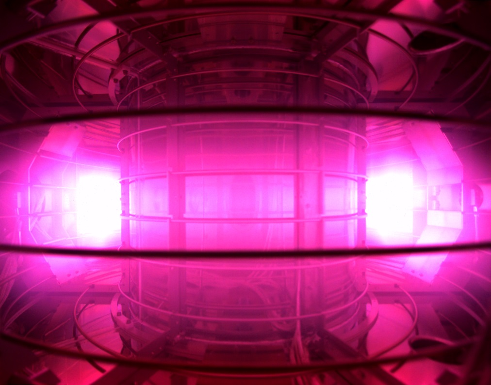

# CHERAB-PHiX


[](https://zenodo.org/badge/latestdoi/239309930)


[](https://results.pre-commit.ci/latest/github/munechika-koyo/cherab_phix/master)
[](https://cherab-phix.readthedocs.io/en/stable/?badge=stable)

[](https://github.com/psf/black)
[](https://pycqa.github.io/isort/)
[](https://github.com/PyCQA/docformatter)
[](https://numpydoc.readthedocs.io/en/latest/format.html)
[](https://github.com/pre-commit/pre-commit)


CHERAB for PHiX, which is a small tokamak device in Tokyo Institute of Technology
For more information, see the [documentation pages](https://cherab-phix.readthedocs.io/).

Quick installation
-------------------
Install it from GitHub repository with pip:

```Shell
python -m pip install cherab-phix
```

For Developpers
---
If you would like to modificate codes, it is much easier to create a conda development environment after cloning repository.
```Shell
conda env create -f environment.yaml
conda activate cherab-phix-dev
python dev.py build
python dev.py install
```
And please follows the development [specified procedure](https://cherab-phix.readthedocs.io/en/development/user/contribution.html).



*Caption: The plasma discharged image captured by the high-speed camera at PHiX.*
